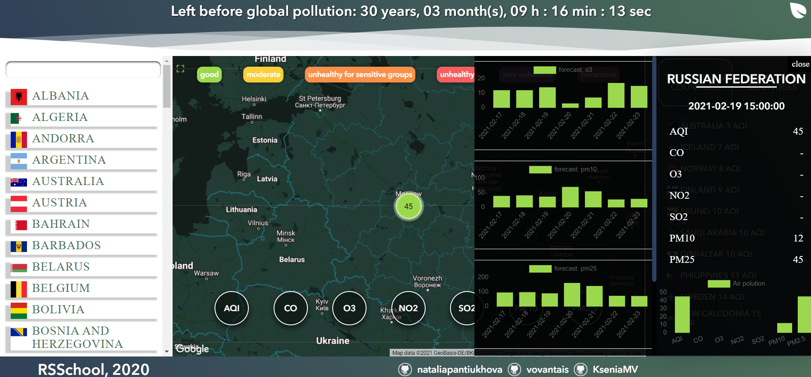

# eco-app
## An application that allows you to track the level of air pollution around the world in real-time. The indicator AQI and others are monitored. Unfortunately, not all countries conduct such studies, and not always the transfer of evidence occurs daily.

## Technologies
+ js/ts
+ scss
+ webpack
+ api [link ti API](https://aqicn.org/api/ru/)

## Developers
+ KseniaMV [link to github](https://github.com/KseniaMV)
+ vovantais [link to github](https://github.com/vovantais)
+ nataliapantiukhova [link to github](https://github.com/nataliapantiukhova)
